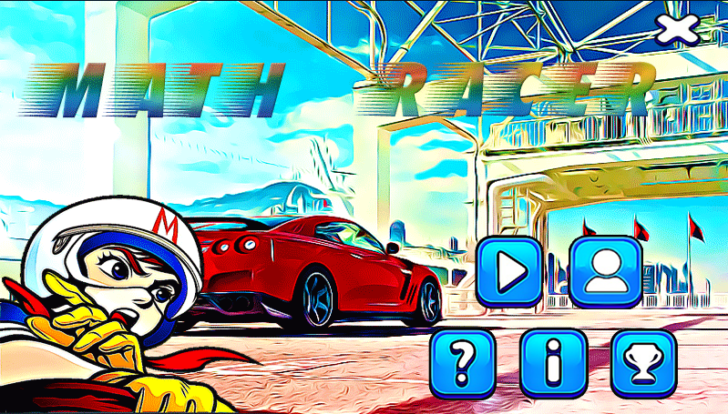
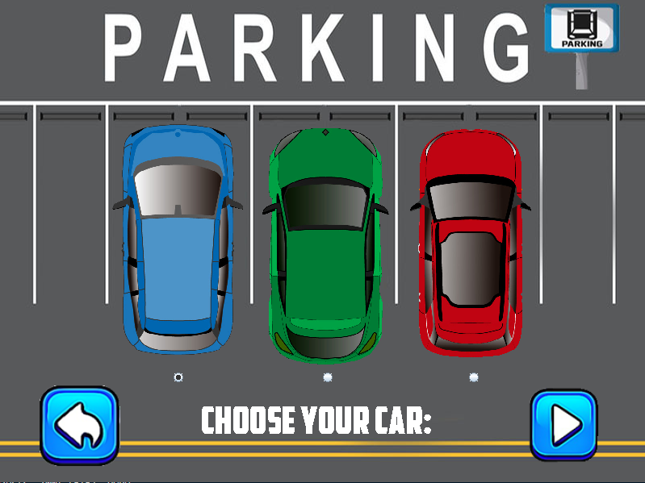
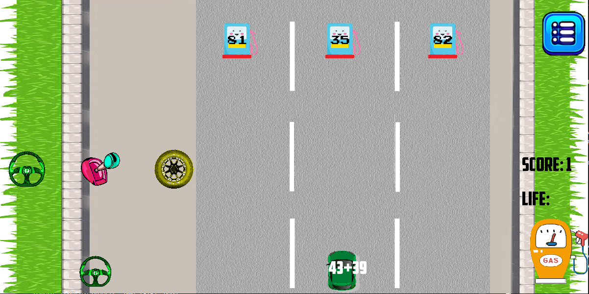

# Math Racer

- One of the very first applications that I developed using Java. This is a game that involves solving simple math questions while trying to maintain the speed by matching the right pairs of images.

## Gameplay screenshots:

